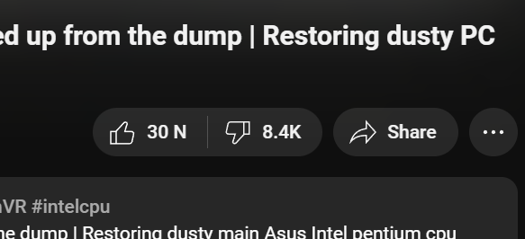

# Return YouTube Dislike

Return YouTube Dislike is a browser extension that restores the dislike count on YouTube videos, providing users with better insights into video ratings.

## Features

- **Restore the Dislike Count**: See the actual number of dislikes on YouTube videos, helping you gauge video quality.
- **Accurate Data**: The dislike count is retrieved from a combination of cached data, user feedback, and public API estimates.
- **Lightweight and Efficient**: Minimal performance impact while browsing YouTube.

## Installation

1. **Clone** the repository (or Download ZIP):
    ```bash
    git clone https://github.com/DuckCIT/Return-YouTube-Dislike.git
    ```
2. **Load the extension** on your browser:
   - Go to `chrome://extensions/` on Chrome or `edge://extensions/` on Edge.
   - Enable **Developer mode**.
   - Select **Load unpacked** and choose the project folder.

3. **Activate** the extension: The Return YouTube Dislike icon will appear on your browser toolbar.

## How to Use

1. Open YouTube and play any video.
2. The dislike count will be restored below the like button.
3. No additional configuration is required – it works automatically!

<div align="center">
  
</div>

## Why Use This Extension?

Since YouTube removed public dislike counts, users have lost a critical way to evaluate content quality. Return YouTube Dislike brings back this feature, ensuring a more transparent viewing experience.

## Copyright

© 2024 by Nguyen Trong Duc (DuckCIT). All rights reserved. You are welcome to build upon this project, but please give credit to the original author.

## Contact

For questions or feedback, please visit the [Contact Page](https://duckcit.me) or leave a comment on GitHub.

## License

This project is licensed under the MIT License. See the [LICENSE](LICENSE) file for details.

---

We hope Return YouTube Dislike enhances your YouTube experience by bringing back the transparency of video ratings!

